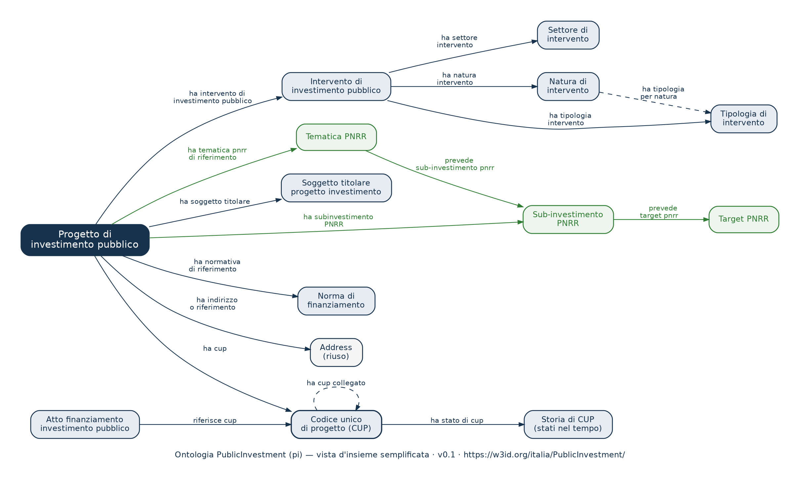
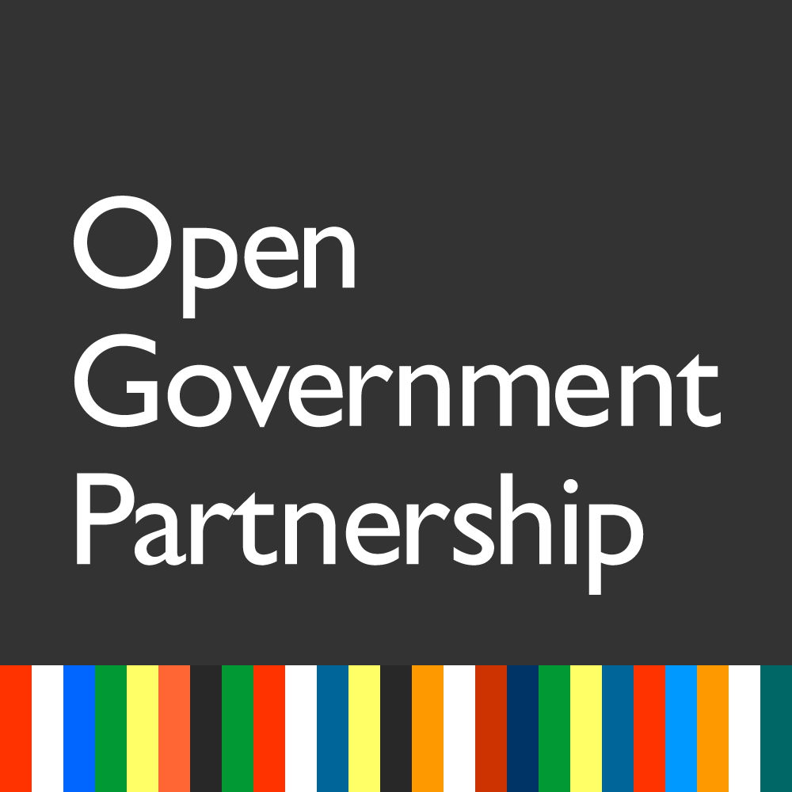
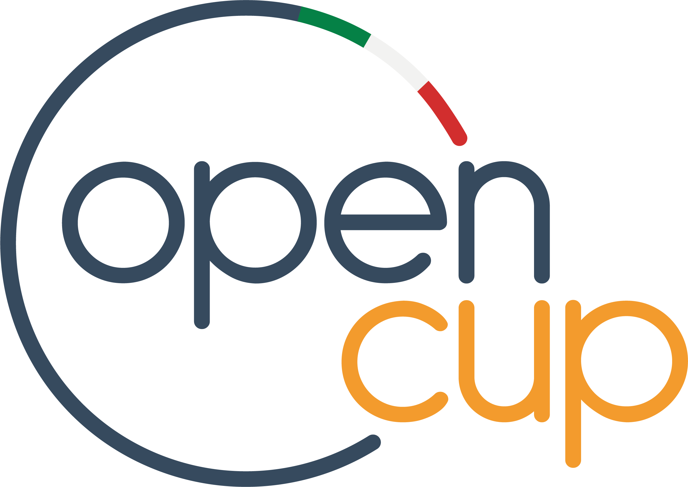

<!--
  README istituzionale del repository  PCM-DIPE/public-investment
  (deliverable Fase B — repository dei semantic assets del dominio investimenti pubblici).
  NON è il README della cartella w3id (perma-id/w3id.org/italia/PublicInvestment), che resta minimale.

  LOGHI: l'intestazione grafica è momentaneamente sostituita da un'intestazione testuale.
  Per ripristinarla, caricare i loghi ufficiali in docs/img/ (nomi file indicati in
  docs/img/README.md) e riattivare il blocco commentato qui sotto.
-->

<!--
<p align="center">
  
  &nbsp;&nbsp;&nbsp;
  
  &nbsp;&nbsp;&nbsp;
  
</p>
-->

<p align="center">
  <strong>Presidenza del Consiglio dei Ministri</strong><br>
  Dipartimento per la programmazione e il coordinamento della politica economica (DIPE)<br>
  <em>con la semantic stewardship di ISTAT e in coordinamento con il Dipartimento per la Trasformazione Digitale</em>
</p>

<h1 align="center">Ontologia del dominio degli Investimenti Pubblici</h1>
<p align="center"><strong>PublicInvestment</strong> &nbsp;·&nbsp; prefisso <code>pi</code> &nbsp;·&nbsp; basata sul <em>Codice Unico di Progetto (CUP)</em> e su OpenCUP</p>

<p align="center">
  <a href="https://w3id.org/italia/PublicInvestment"></a>
  <a href="https://schema.gov.it"></a>
  
  <a href="LICENSE"></a>
  
</p>

---

## Descrizione

Questo repository ospita i **semantic assets** del dominio degli **investimenti pubblici** della Pubblica Amministrazione italiana: l'ontologia **PublicInvestment**, i relativi **vocabolari controllati** (in predisposizione) e gli **identificatori persistenti** dei progetti CUP.

L'ontologia è il prodotto dell'analisi semantica del **Codice Unico di Progetto (CUP)** e del patrimonio informativo del portale **[OpenCUP](https://www.opencup.gov.it)**. È sviluppata dal **Dipartimento per la programmazione e il coordinamento della politica economica (DIPE)** della Presidenza del Consiglio dei Ministri, con la *semantic stewardship* dell'**ISTAT** e in coordinamento con il **Dipartimento per la Trasformazione Digitale (DTD)**, nell'ambito dell'**Impegno C6 del 6° Piano d'Azione Nazionale per il Governo Aperto (OGP) 2024–2026**.

Il namespace persistente `w3id.org/italia/PublicInvestment` è registrato secondo il modello *domain-contributor* del namespace nazionale `w3id.org/italia`. L'ontologia riusa ontologie della rete **OntoPiA** (tra cui CLV, COV, TI e SKOS) ed è in corso di indicizzazione nel **Catalogo Nazionale dei dati semantici ([schema.gov.it](https://schema.gov.it))**.

## URI persistenti

| Risorsa | URI |
|---|---|
| Ontologia | `https://w3id.org/italia/PublicInvestment/onto/PublicInvestment` |
| Vocabolari controllati | `https://w3id.org/italia/PublicInvestment/controlled-vocabulary/{nome}` |
| Progetti (per codice CUP) | `https://w3id.org/italia/PublicInvestment/data/CUP/{CODICE_CUP}` |

> Gli URI sotto `data/CUP/` sono gli **identificatori ufficiali e persistenti** dei progetti d'investimento nei Linked Open Data e risolvono alla scheda pubblica del progetto su OpenCUP.

L'URI dell'ontologia supporta la *content negotiation*: le richieste con `Accept` RDF (`text/turtle`, `application/rdf+xml`, `application/n-triples`) risolvono alle serializzazioni pubblicate in questo repository; le richieste HTML rinviano alla documentazione sul Catalogo Nazionale dei dati semantici, disponibile a valle dell'indicizzazione.

## Il modello

<p align="center">
  
</p>
<p align="center"><sub>Vista d'insieme semplificata, derivata dalla serializzazione pubblicata (v0.1). Il sorgente vettoriale è disponibile in <code>docs/diagrammi/</code>.</sub></p>

L'ontologia modella le entità centrali del sistema CUP: il **progetto** d'investimento, il **codice unico di progetto** e la sua storia, gli **interventi** con i relativi **schemi di classificazione** (natura, settore, sottosettore, tipologia, categoria), i **soggetti** (titolari, attuatori, accreditati), gli **atti di finanziamento**, la **localizzazione** e gli elementi **PNRR** (tematiche, sub-investimenti, target).

## Struttura del repository

```
public-investment/
├── README.md
├── LICENSE                          ← CC-BY 4.0
├── assets/
│   └── ontologies/
│       └── PublicInvestment/
│           ├── latest/              ← PublicInvestment.{ttl,rdf,json-ld}
│           └── v0.1/                ← copia immutabile della versione rilasciata
└── docs/
    ├── diagrammi/                   ← diagrammi dell'ontologia (PNG/SVG)
    └── img/                         ← loghi e immagini del README
```

In predisposizione: `assets/controlled-vocabularies/{nome}/latest/`, destinata ad accogliere i vocabolari controllati del dominio.

## Serializzazioni

| Formato | File | Uso |
|---|---|---|
| Turtle | `PublicInvestment.ttl` | formato di riferimento |
| RDF/XML | `PublicInvestment.rdf` | interoperabilità, import in tool (es. Protégé) |
| JSON-LD | `PublicInvestment.json-ld` | integrazione in applicazioni web |

## Come citare

> DIPE — Dipartimento per la programmazione e il coordinamento della politica economica (Presidenza del Consiglio dei Ministri). *Ontologia del dominio degli Investimenti Pubblici (PublicInvestment)*, v0.1. URI: https://w3id.org/italia/PublicInvestment — Licenza CC-BY 4.0.

## Manutentori e contatti

- **Handle GitHub (manutentore):** [@PCM-DIPE](https://github.com/PCM-DIPE)
- Francesco De Stefanis (DIPE) — f.destefanis@governo.it
- Leonardo Salvatori (DIPE) — leo.salvatori@governo.it
- *Semantic stewardship:* ISTAT

## Licenza

Distribuito con licenza **[Creative Commons Attribution 4.0 International (CC-BY 4.0)](LICENSE)**.

## Ringraziamenti

Lavoro svolto nell'ambito dell'**Impegno C6 del 6° Piano d'Azione Nazionale OGP (2024–2026)** — [Open Government Partnership](https://www.opengovpartnership.org) / [open.gov.it](https://open.gov.it) — con il contributo di ISTAT e del Dipartimento per la Trasformazione Digitale, a partire dal patrimonio informativo di [OpenCUP](https://www.opencup.gov.it).

<!--
<p align="center">
  
  &nbsp;&nbsp;&nbsp;
  
</p>
-->
